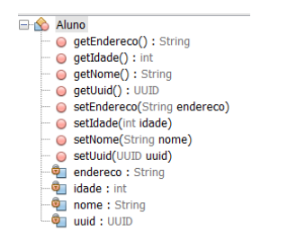
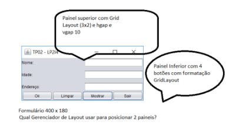
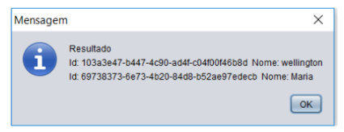
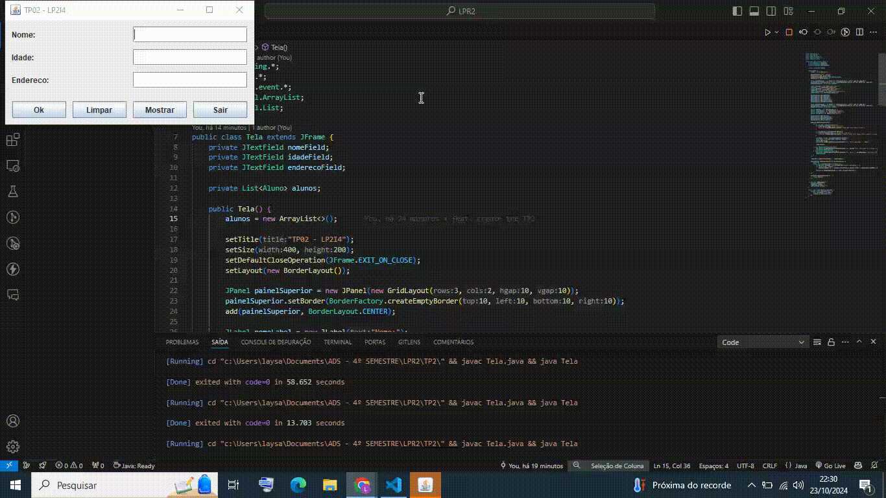

# TRABALHO PRÁTICO 02 - Sistema de Cadastro de Alunos

**Aluna:** Laysa Bernardes Campos da Rocha - CB3024873 

**Aluno:** Lucas Lopes Cruz - CB3025284 

Obs: O vídeo demonstrando o funcionamento da aplicação esta listado abaixo.

## Exercício 01 
Desenvolver o seguinte sistema abaixo, empregando os conhecimentos adquiridos nas aulas sobre interfaces gráficas em java.

### a.
Criar a seguinte classe Aluno, conforme diagrama:

Dica: Pesquisar a classe UUID.

### b.
Implementar o formulário possibilitando ao usuário cadastrar uma lista de alunos,
respeitando as seguintes regras:

1. Quando o botão Ok for pressionado os dados contidos em tela devem
ser armazenados em memória (utilizar a interface List <E> em
conjunto com a classe ArrayList<E> para armazenar a lista de alunos
cadastrados em memória)
2. Limpar apaga o conteúdo dos labels.
3. Botão Mostrar exibe o pop-up a ser desenvolvido no item (C) deste
trabalho.
4. Botão Sair encerra a aplicação.

### c.

Criar o mecanismo de exibição abaixo, que contempla todos os ids e nomes dos alunos
cadastrados nesta execução do programa, utilizando a classe:
JOptionPane.showMessageDialog(this, mensagem);

# DEMOSTRAÇÃO 

[[Assista ao vídeo]](https://drive.google.com/file/d/1iyIGBdw1jX-HO7SYNhLOkHD9cpBe9eVf/view?usp=sharing)

