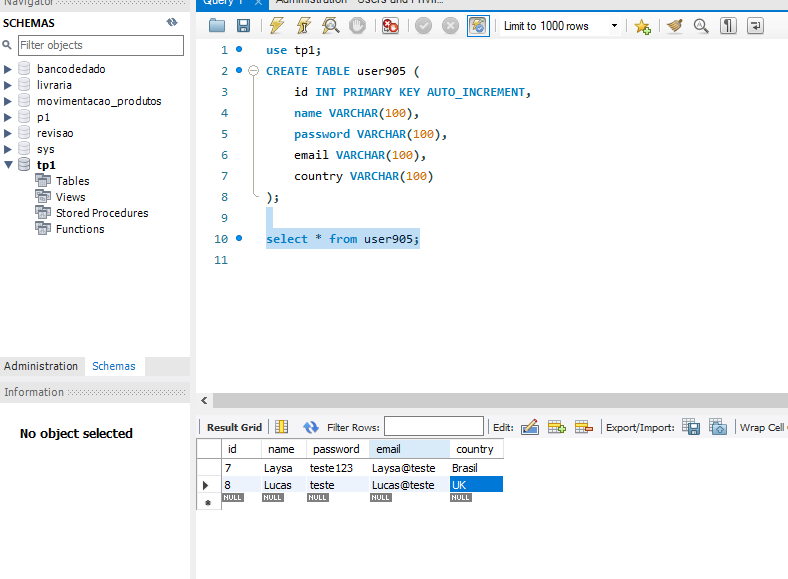
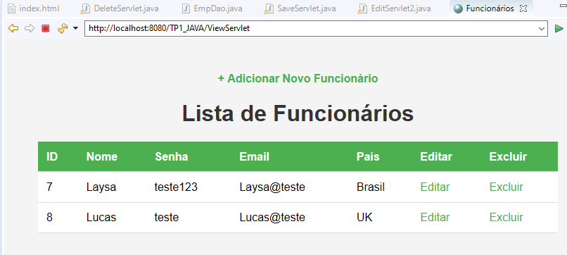

# TRABALHO PRÁTICO 01 

**Aluna:** Laysa Bernardes Campos da Rocha - CB3024873 

**Aluno:** Lucas Lopes Cruz - CB3025284 

Obs: Os vídeos demonstrando o funcionamento da aplicação estão listados abaixo.

# CRUD com Java Servlet

Este projeto é um CRUD (Create, Read, Update, Delete) simples feito com **Java Servlet** e **JDBC** para a disciplina de **Sistemas Web**.

## ✅ O que foi feito

- Criação de uma tabela no banco de dados com os campos: `id`, `name`, `password`, `email`, `country`
- Implementação do CRUD completo (cadastrar, listar, editar, excluir)
- Integração com banco de dados via JDBC
- Interface simples em HTML
- Comentários com os nomes da dupla em todos os arquivos `.java`
- Página extra com os créditos da dupla
- Prints do banco de dados e da tela com os dados dos funcionários

