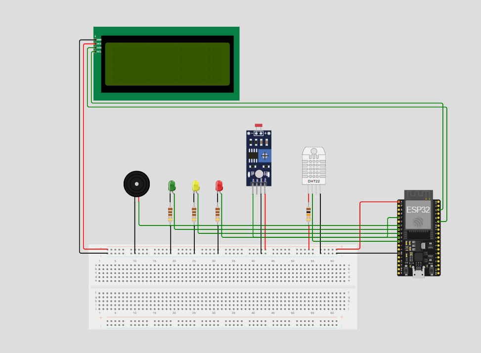
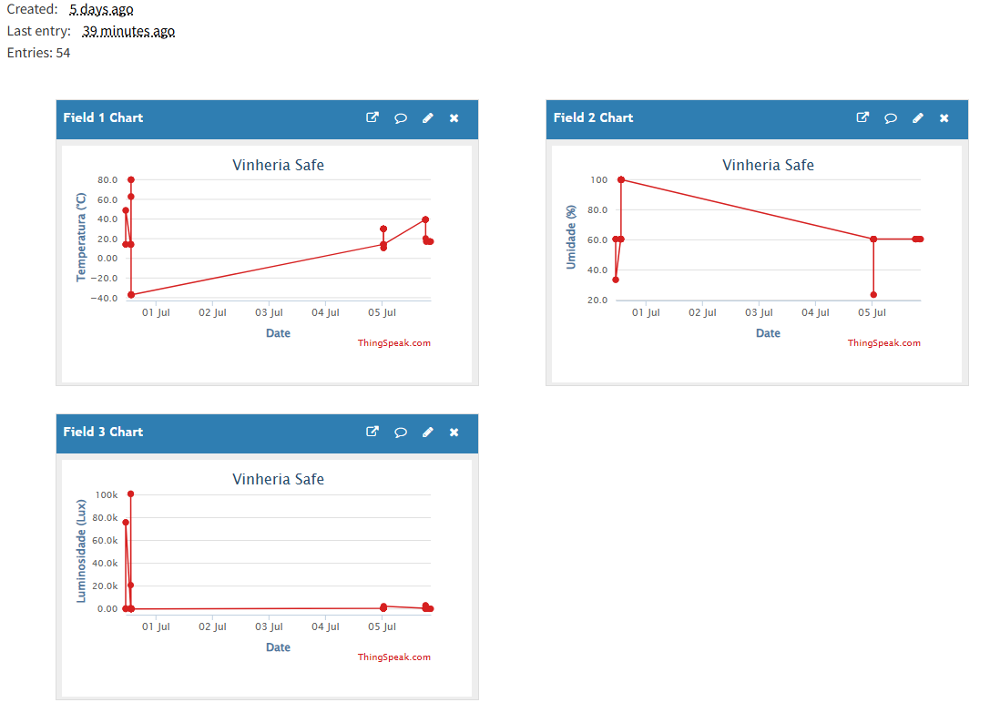
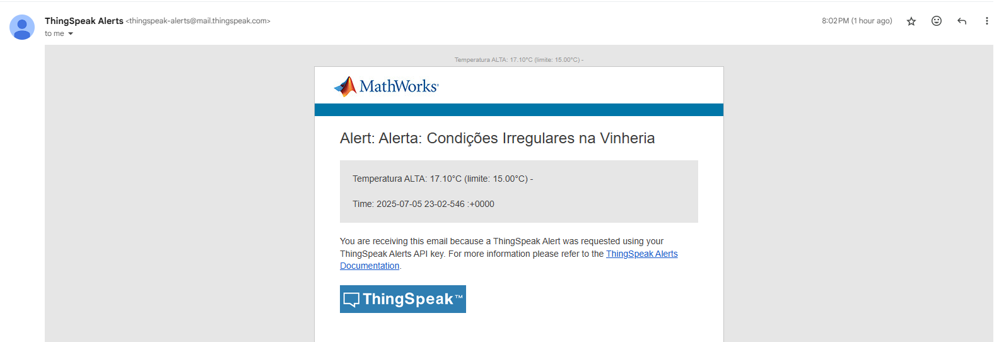

# 🍷 Projeto Final: Vinheria Safe 🛡️

### Projeto de IoT para Monitoramento de Adegas, desenvolvido para a disciplina de Introdução à Automação de Ambientes e Processos.

<p align="center">
  
  
  
</p>

---

## 📚 Índice

* [1. Descrição do Projeto](#1-descrição-do-projeto-)
* [2. Contexto do Problema](#2-contexto-do-problema-)
* [3. Tecnologias Utilizadas](#3-tecnologias-utilizadas-)
* [4. Explicação de Funcionamento](#4-explicação-de-funcionamento-%EF%B8%8F)
* [5. Instruções para Replicar](#5-instruções-para-replicar-%EF%B8%8F)
* [6. Links e Capturas de Tela](#6-links-e-capturas-de-tela-)
* [7. Autores](#7-autores-)

---
## 1. Descrição do Projeto 📝
Este projeto é um sistema de Internet das Coisas (IoT) criado não apenas para **monitorar**, mas também para **controlar ativamente** as condições ambientais de uma adega. Desenvolvido no ambiente de simulação Wokwi, ele utiliza um microcontrolador ESP32 para ler variáveis críticas, acionar alertas, corrigir desvios de temperatura automaticamente e enviar todos os dados para a plataforma de nuvem ThingSpeak para visualização remota.

## 2. Contexto do Problema 🤔
A preservação de vinhos de qualidade é um processo rigoroso que exige um controle ambiental de alta precisão. O principal desafio que este projeto aborda é a vulnerabilidade do armazenamento de vinhos a fatores ambientais críticos. Flutuações de temperatura, umidade ou exposição à luz, mesmo que pequenas, podem comprometer irreversivelmente um investimento de alto valor, tornando a vigilância constante uma necessidade.

Foi com base nesse problema real que o desafio inicial foi proposto à turma: desenvolver um sistema de monitoramento local para uma adega. Contudo, ao analisar essa solução base, identificamos sua principal limitação: um alarme que soa apenas localmente tem pouca eficácia prática, pois não pode alertar um responsável ausente sobre um problema urgente.

O objetivo deste projeto, portanto, foi evoluir essa solução, aplicando o conceito de Internet das Coisas (IoT) para criar uma ferramenta de vigilância verdadeiramente robusta e conectada. Para isso, mantivemos o foco nos três fatores mais críticos:

* 🌡️ **Temperatura:**  Essencial para o correto envelhecimento da bebida. Variações podem estragar o vinho de forma irreversível.

* 💧 **Umidade:** Crítica para a saúde da rolha. Níveis inadequados podem levar à oxidação do vinho ou à criação de mofo. 

* ☀️ **Luminosidade:** A luz degrada os compostos do vinho, afetando seu sabor e aroma. O ambiente precisa ser escuro.

Assim, o projeto representa a nossa solução para este desafio: a transformação de um simples monitor local em um sistema de vigilância conectado, capaz de notificar o usuário em qualquer lugar e a qualquer momento, agregando real valor e segurança ao processo.

## 3. Tecnologias Utilizadas 💻

* **Hardware:**
    * 🔌 **Microcontrolador:** ESP32 
    * 🌡️ **Sensores:** DHT22 (Temperatura e Umidade), LDR (Luminosidade) 
    * 🔊 **Atuadores:** LEDs (Verde, Amarelo, Vermelho), Buzzer
    * 🖥️ **Display:** LCD 20x4 com interface I2C

* **Plataformas e Software:**
    * 🌐 **Simulador:** Wokwi Simulator 
    * 👨‍💻 **Programação:** Arduino Framework (C++)
    * ☁️ **Nuvem IoT:** ThingSpeak (com MATLAB Analysis) 
    * 📂 **Versionamento:** GitHub 

## 4. Explicação de Funcionamento ⚙️

O sistema opera em um ciclo contínuo e inteligente:

1.  📡 **Leitura:** O ESP32 lê os dados dos sensores a cada 5 segundos.
2.  🧠 **Processamento Local:** O código compara os valores com limiares ideais. LEDs de status (🟢 OK, 🟡 Atenção, 🔴 Perigo) e um buzzer fornecem feedback imediato no local. O display LCD mostra os valores e o status em tempo real.
3.  ☁️ **Comunicação com a Nuvem:** Os dados são enviados para um canal no ThingSpeak, onde gráficos públicos são gerados para acompanhamento.

#### 🔔 Notificações de Alerta por E-mail

Para notificar o usuário sobre problemas mesmo à distância, o sistema utiliza uma rotina de verificação periódica através do ThingSpeak.

Usando o app **TimeControl**, o script de análise em MATLAB é executado automaticamente em intervalos definidos (por exemplo, a cada 10 minutos). Este script verifica todas as variáveis (temperatura, umidade e luz). Se uma ou mais condições estiverem fora dos limites de segurança, um **único e-mail de alerta consolidado** é enviado, detalhando todos os problemas encontrados.

Se todas as medições estiverem dentro da normalidade, **nenhum e-mail é enviado**, garantindo que o usuário seja notificado apenas quando sua atenção é realmente necessária. Esta abordagem garante a estabilidade do sistema, evitando falhas por excesso de requisições.

## 5. Instruções para Replicar 🛠️

Para replicar este projeto por completo, siga os passos detalhados abaixo, divididos entre a configuração do hardware simulado, da plataforma de nuvem e do código.

### Parte 1: Configuração do Hardware (Wokwi)

1.  **Clonar o Repositório:** Primeiro, clone este repositório para ter acesso a todos os arquivos necessários, incluindo o código-fonte do ESP32 e o código de análise do ThingSpeak.
    ```bash
    git clone https://github.com/Laysabernardes/ProjetoFinal_IAAP.git
    ```
2.  **Montagem do Circuito:** O circuito deve ser montado no Wokwi utilizando os seguintes componentes:
    * 1x Placa ESP32
    * 1x Sensor de Temperatura e Umidade DHT22
    * 1x Fotoresistor (LDR) com um resistor de 10kΩ
    * 3x LEDs de Status (Verde, Amarelo, Vermelho) com resistores de 110Ω cada
    * 1x Buzzer Ativo
    * 1x Display LCD 20x4 com módulo I2C
    * 1x Protoboard e jumpers para as conexões

    ** Para as conexões, consulte o arquivo [diagram.json](https://github.com/Laysabernardes/ProjetoFinal_IAAP/blob/main/diagrama.json) do repositório ou a captura de tela na [seção 6](#6-links-e-capturas-de-tela-).

### Parte 2: Configuração da Nuvem (ThingSpeak)

1.  **Criação do Canal:**
    * Acesse sua conta no [ThingSpeak](https://thingspeak.com/) e clique em "New Channel".
    * Dê um nome ao canal (ex: "Vinheria Safe").
    * Habilite **3 campos (Fields)** e nomeie-os para facilitar a identificação:
        * `Field 1: Temperatura (C)`
        * `Field 2: Umidade (%)`
        * `Field 3: Luminosidade (lx)`
    * Salve o canal. Na aba **"API Keys"**, anote o seu **"Channel ID"** e a **"Write API Key"**.

2.  **Configuração dos Alertas por E-mail:**
    * No menu do ThingSpeak, vá em `Apps > MATLAB Analysis` e clique em "New".
    * Selecione a primeira opção, o template **"Custom (no starter code)"**, e clique em "Create".
    * No repositório que você clonou, abra o arquivo [alerta_thingspeak.m](https://github.com/Laysabernardes/ProjetoFinal_IAAP/blob/main/alerta_thingspeak.m) (ou o nome que você deu ao seu código MATLAB), copie todo o conteúdo e cole no editor do MATLAB Analysis.
    * **Importante:** Você precisa de uma "Alerts API Key". No ThingSpeak, vá em `Account > My Profile` e copie sua **"Alerts API Key"**.
    * No código MATLAB que você colou, atualize a variável `alert_api_key` com a chave que você acabou de copiar.
    * Salve a análise.

3.  **Agendamento da Verificação:**
    * Ainda na página do MATLAB Analysis, role para baixo até a seção "TimeControl".
    * Clique em "Create a new TimeControl" para agendar a execução do seu script.
    * Configure-o para rodar em uma frequência recorrente (ex: a cada 10 ou 15 minutos). Isso fará com que o ThingSpeak verifique as condições e envie e-mails automaticamente.

### Parte 3: Código e Execução Final

1.  **Configurar o Código do ESP32:**
    * Abra o arquivo `.ino` do projeto.
    * Localize as seguintes linhas e substitua os valores pelos que você anotou no Passo 2.1:
        ```c++
        unsigned long myChannelNumber = SEU_CHANNEL_ID;
        const char * myWriteAPIKey = "SUA_WRITE_API_KEY";
        ```
    * As credenciais de Wi-Fi já estão configuradas para o Wokwi (`Wokwi-GUEST`).
2.  **Iniciar a Simulação:**
    * Com o código configurado, abra o projeto no Wokwi e clique no botão de **Play (seta verde)**.
    * O ESP32 irá se conectar ao Wi-Fi, começar a ler os sensores e enviar os dados para o seu canal no ThingSpeak.
    * Você poderá ver os gráficos sendo preenchidos no ThingSpeak e, se alguma condição de alerta for atendida, o e-mail será disparado na próxima execução agendada do TimeControl.

## 6. Links e Capturas de Tela 🔗

* ➡️ **Projeto no Wokwi:** `[https://wokwi.com/projects/435202695698577409]` 
* ➡️ **Canal no ThingSpeak:** `[https://thingspeak.mathworks.com/channels/3000536]` 
* ➡️ **Vídeo de Apresentação:** `[##]` 

---

### 🖼️ Circuito no Wokwi


### 📈 Gráficos no ThingSpeak


### 📧 Exemplo de E-mail de Alerta


---

## 7. Autores 👨‍💻

* **Beatriz Bastos Borges** - `CB3024946`
* **Laysa Bernardes Campos da Rocha** - `CB3024873`
* **Lucas Lopes Cruz** - `CB3025284`
* **Miguel Luizatto Alves** - `CB3025039`
