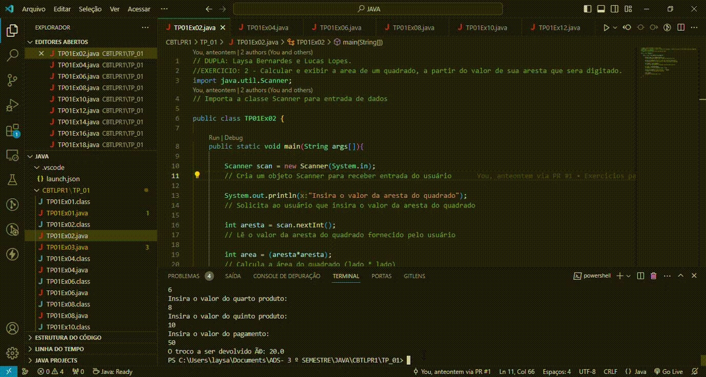
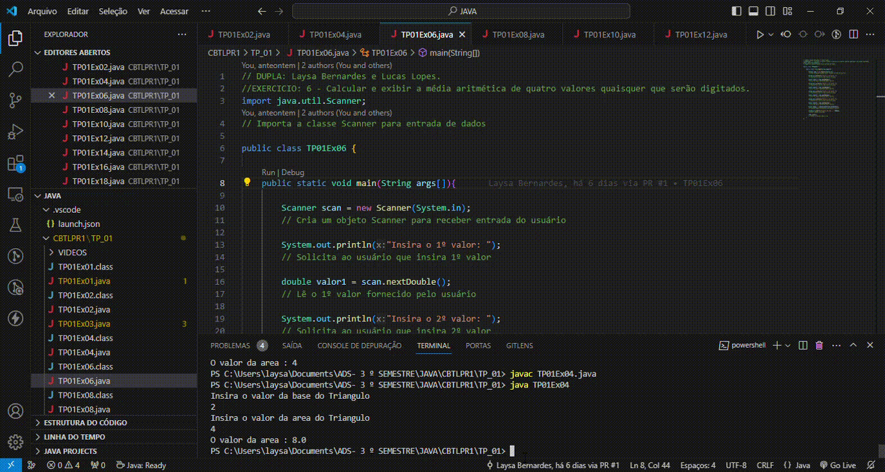
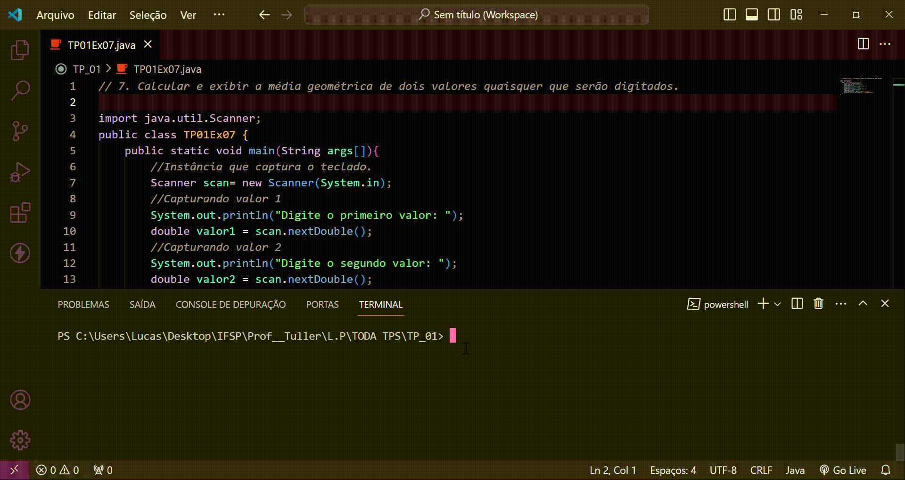
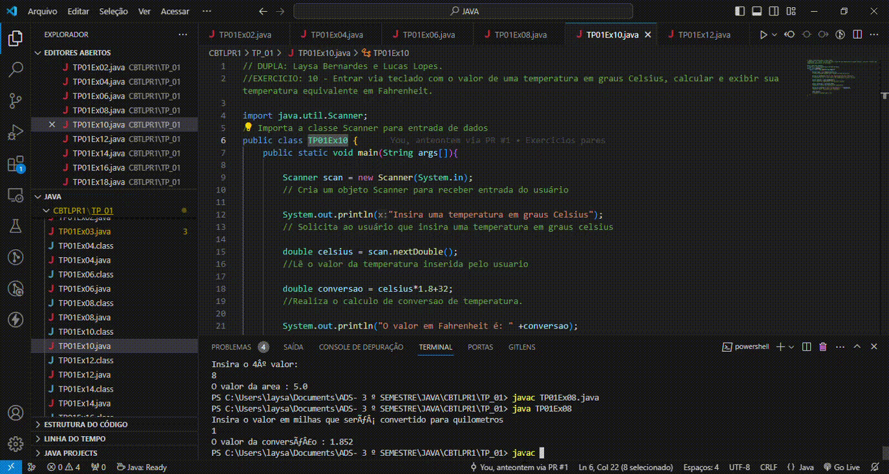
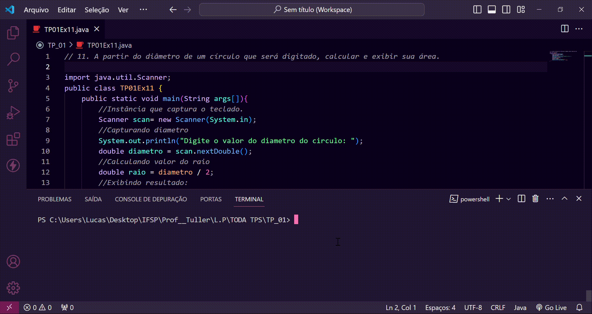
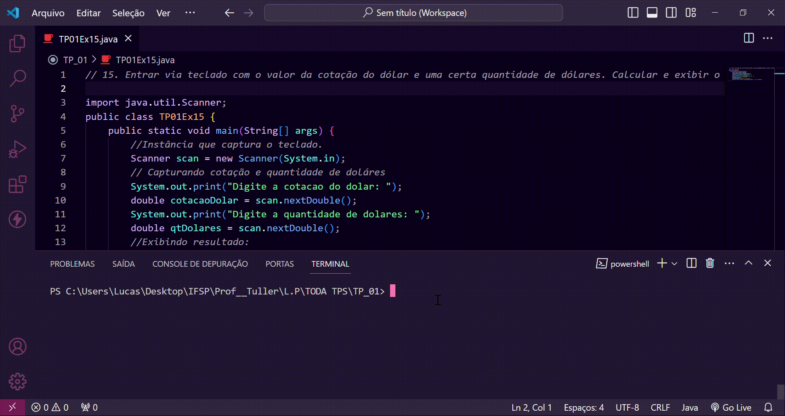
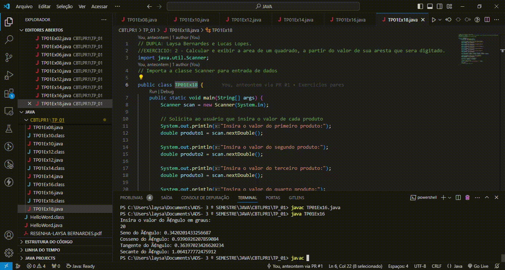

# Trabalho Prático I

DUPLA: Laysa Bernardes CB3024873 e Lucas Lopes CB3025284. 

## GIFs

Aqui estão os GIFs do projeto:

### GIF 1: TP01Ex02.gif

### GIF 2: TP01Ex02.gif

### GIF 3: TP01Ex03.gif

### GIF 4: TP01Ex04.gif

### GIF 5: TP01Ex05.gif

### GIF 6: TP01Ex06.gif

### GIF 7: TP01Ex07.gif

### GIF 8: TP01Ex08.gif

### GIF 9: TP01Ex09.gif

### GIF 10: TP01Ex10.gif

### GIF 11: TP01Ex11.gif

### GIF 12: TP01Ex12.gif

### GIF 13: TP01Ex13.gif

### GIF 14: TP01Ex14.gif

### GIF 15: TP01Ex15.gif

### GIF 16: TP01Ex16.gif

### GIF 17: TP01Ex17.gif

### GIF 18: TP01Ex18.gif

