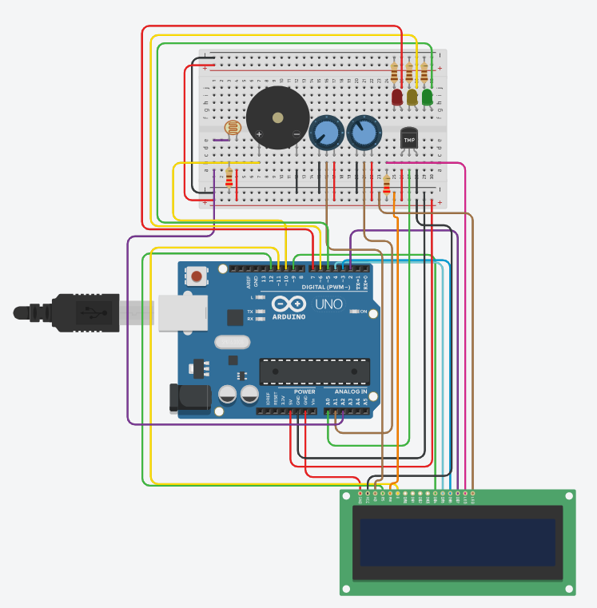

# 🤖 Projeto Vinheria Safe: Monitor de Ambiente para Vinhos

## 📜 Descrição

Este projeto foi desenvolvido como parte do **Desafio 01** da matéria de *Introdução à Automação de Ambientes e Processos*. O objetivo é criar um sistema de monitoramento para uma vinheria, garantindo que as condições de armazenamento dos vinhos (temperatura, umidade e luminosidade) estejam sempre dentro dos padrões ideais para preservar a sua qualidade.

O sistema utiliza um Arduino Uno para ler dados de múltiplos sensores e, com base nesses dados, aciona alertas visuais (LEDs), sonoros (Buzzer) e exibe informações detalhadas em um Display LCD 16x2.

---
## 💡 Tinkercad

[Projeto de Sensor de Temperatura e Umidade no Tinkercad](https://www.tinkercad.com/things/cSuUOUxI2GD-sensor-de-temperatura-e-umidade-ok)

---

## 📋 Funcionalidades Principais

O sistema implementa 13 requisitos essenciais para o controle do ambiente:

### 💡 Luminosidade
* **LED Verde (Status OK):** Indica que o ambiente está escuro, condição ideal para os vinhos.
* **LED Amarelo (Atenção):** Indica que o ambiente está à "meia luz".
* **🚨 LED Vermelho e Buzzer (Alerta Crítico):** Indicam que o ambiente está "muito claro", o que pode danificar os vinhos.

### 🌡️ Temperatura
* **Faixa Ideal:** Entre 10°C e 15°C.
* **Display "Temperatura OK":** Mostra que a temperatura está na faixa correta, junto com o valor exato.
* **🚨 LED Amarelo e Buzzer (Alerta Crítico):** Indicam que a temperatura está fora da faixa ideal (muito alta ou muito baixa).
* **Display de Alerta:** Exibe as mensagens "Temp. ALTA" ou "Temp. BAIXA" com o valor medido.

### 💧 Umidade
* **Faixa Ideal:** Entre 50% e 70%.
* **Display "Umidade OK":** Mostra que a umidade está na faixa correta, junto com o valor exato.
* **🚨 LED Vermelho e Buzzer (Alerta Crítico):** Indicam que a umidade está fora da faixa ideal (muito alta ou muito baixa).
* **Display de Alerta:** Exibe as mensagens "Umidade ALTA" ou "Umidade BAIXA" com o valor medido.

### ⚙️ Operação do Sistema
* **Média de Leituras:** Para garantir precisão, todos os valores exibidos são a média de 5 leituras consecutivas dos sensores.
* **Atualização em Tempo Real:** O sistema atualiza todas as informações e alertas a cada 5 segundos.

---

## 🔌 Componentes Utilizados

* 1x Placa Arduino Uno R3
* 1x Display LCD 16x2
* 1x Protoboard (Placa de Ensaio)
* 1x LED Verde 5mm
* 1x LED Amarelo 5mm
* 1x LED Vermelho 5mm
* 3x Resistores de 110Ω (para os LEDs)
* 1x Fotorresistor (LDR)
* 1x Resistor de (220Ω)
* 1x Sensor de Temperatura (TMP36)
* 2x Resistor (220Ω)
* 2x Potenciômetro de 250kΩ (Um para o sensor de umidade e outro para o display)
* 1x Buzzer (Piezo)
* Jumpers (Fios de Conexão)

---

## ✨ Demonstração das Funcionalidades

Abaixo estão alguns GIFs que demonstram as principais funcionalidades do sistema em ação.

### 🌡️ Alerta de Temperatura Alta
Quando a temperatura ultrapassa 15°C, o LED amarelo acende, o buzzer dispara e o display mostra o alerta correspondente.

### 💧 Alerta de Umidade Baixa
Se a umidade cai abaixo de 50%, o LED vermelho e o buzzer são ativados, e o display mostra a mensagem "Umidade BAIXA".

### 💡 Transição de Luminosidade
O sistema reage em tempo real às mudanças de luz, acionando o LED correspondente e atualizando o display.

---
## 🎬 Vídeo de Demonstração

Um vídeo de 3 minutos explicando a implementação do projeto, as dificuldades encontradas e as soluções aplicadas está disponível no link abaixo.

[Youtube - Projeto](https://youtu.be/h4ULBU8l6DU?si=NWrLc1X3uLW6ZbgO)

---

## 👨‍💻 Autores

* **Beatriz Bastos Borges** - CB3024946
* **Laysa Bernardes Campos da Rocha** - CB3024873
* **Lucas Lopes Cruz** - CB3025284
* **Miguel Luizatto Alves** - CB3025039

