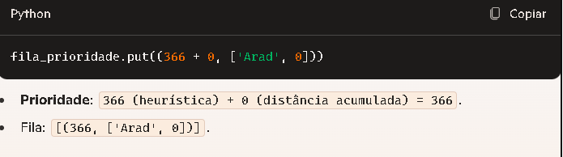
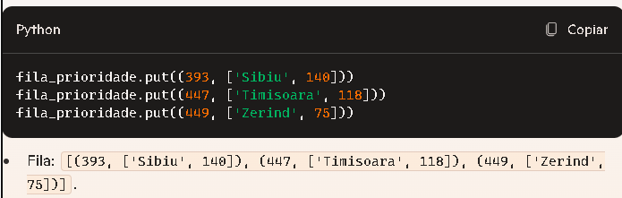
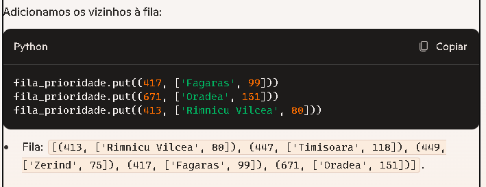

Simulação do Algoritmo A*
## 1. Inicialização
  Cidade inicial: Arad
  Adicionamos Arad à fila de prioridade:

  

   Prioridade: 366 (heurística) + 0 (distância acumulada) = 366.
   Fila: [(366, ['Arad', 0])].

## 2. Primeiro passo: Retira Arad da fila
Retiramos Arad da fila:

      atual = fila_prioridade.get()[1]
Cidade atual: Arad
Caminho: ['Arad']
Distância acumulada: 0.

## 3. Explora os vizinhos de Arad
Os vizinhos de Arad são Sibiu, Timisoara, e Zerind. Calculamos suas prioridades:

Sibiu:
  Heurística: 253
  Distância: 140
  Distância acumulada: 0

  Prioridade: 253 + 140 + 0 = 393.

Timisoara:
  Heurística: 329
  Distância: 118
  Distância acumulada: 0
  
  Prioridade: 329 + 118 + 0 = 447.

Zerind:
  Heurística: 374
  Distância: 75
  Distância acumulada: 0
  
  Prioridade: 374 + 75 + 0 = 449.

Adicionamos as cidades à fila:

## 4. Segundo passo: Retira Sibiu da fila
Retiramos Sibiu da fila:

  atual = fila_prioridade.get()[1]
  Cidade atual: Sibiu
  
  Caminho: ['Arad', 'Sibiu']

  Distância acumulada: 140.

## 5. Explora os vizinhos de Sibiu
Os vizinhos de Sibiu são Fagaras, Oradea, e Rimnicu Vilcea. Calculamos suas prioridades:

Fagaras:
  Heurística: 178
  Distância: 99
  Distância acumulada: 140
  
  Prioridade: 178 + 99 + 140 = 417.

Oradea:
  Heurística: 380
  Distância: 151
  Distância acumulada: 140

  Prioridade: 380 + 151 + 140 = 671.

Rimnicu Vilcea:
  Heurística: 193
  Distância: 80
  Distância acumulada: 140

  Prioridade: 193 + 80 + 140 = 413.

## 6. Próximo passo: Continuar até Bucharest
O processo segue repetindo:

Escolhe o nó com menor prioridade.

Atualiza o caminho e explora os vizinhos.

Adiciona novos nós à fila, até que Bucharest seja escolhido como destino.
